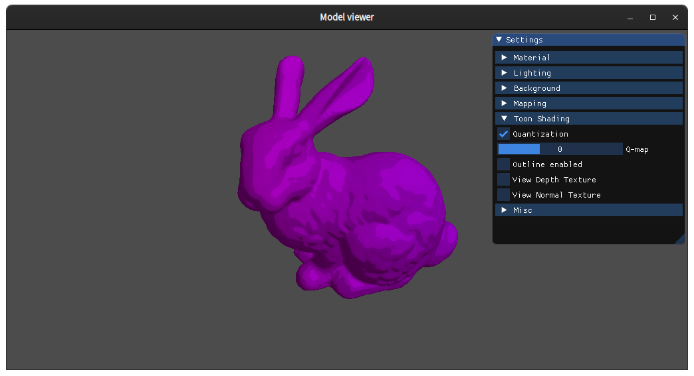
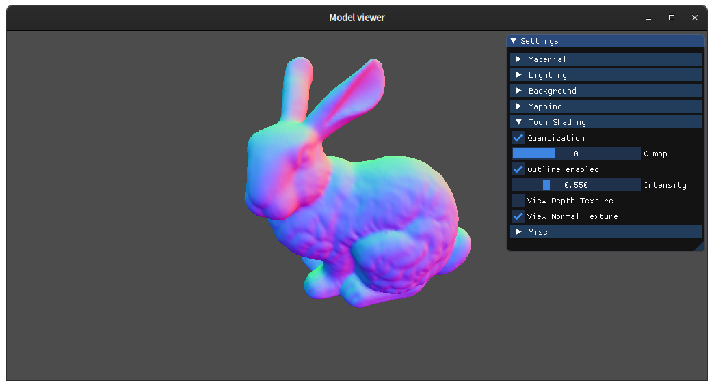

# glTF Viewer

This glTF viewer is an extension of the [code skeleton](https://github.com/cg-uu/gltf_viewer) provided by Uppsala University's Computer Graphics course. It implements the following using OpenGL:

* Varying variables and vertex attributes
* Uniform variables
* Surface normals and GUI
* Transformations and 3D viewing
* Basic per-vertex lighting 
* Blinn-Phong shading
* Normalized Blinn-Phong shading
* Gamma correction
* Image-based lighting (environment mapping)
* Texture mapping
* Shadow mapping
* Framebuffers
* Toon Shading (Cel-shading):
    * Quantized lighting
    *  Sobel edge detection

## About the toon shading (cel-shading)
As the final project for this course, I chose to implement cel-shading, a type of non-photorealistic rendering widely used in computer graphics to make objects appear flat and hand-drawn by limiting colors and adding outlines. A full report can be found [here](./report/finalReport.pdf). Basically, I calculated a depth and normal texture in a seperate framebuffer and applied the sobel operator to detect edges. The detected edges are then rendered black and the rest is rendered using the quantized lighting to create the full effect.  

### Screenshots:
Color quantization:

Depth texture:

Normal texture:

Final Result: 

## Build instructions for Linux

You need the following tools, which can be installed via the package manager of your Linux distribution:

    gcc/g++, CMake 3.5 (or higher), make, git

In addition, you also need to install libraries for OpenGL. On for example Ubuntu 18.04, you can install them with

    sudo apt install libgl1-mesa-dev libxmu-dev libxi-dev libxrandr-dev libxcursor-dev libxinerama-dev

### Environment variables

Before building and running the model viewer, the environment variable `MODEL_VIEWER_ROOT` must be set to point to the directory of this `README.md` file. Example:

    export MODEL_VIEWER_ROOT=$HOME/gltf_viewer

### Building and running the program

To build the program, open a terminal, navigate to
the path in `MODEL_VIEWER_ROOT`, and type

    mkdir build
    cd build
    cmake ../
    make

To run the program, navigate to the resulting executable (model_viewer), and type

    ./model_viewer

Alternatively, run the attached Bash script `build.sh` that will perform all these steps for you:

    ./build.sh

Note: You do not have to run CMake every time you change something in the source files. Just use the generated makefile (or the `build.sh` script) to rebuild the program.

## Build instructions for Windows

We recommend using Visual Studio Community 2019 and CMake GUI 3.14 (or higher) for building the code on Windows. Using WSL on Windows is currently not recommended, because of poor support for graphical applications.

Note: When installing Visual Studio, remember to check the box for "Desktop development with C++" under Workloads, otherwise no C++ tools will be installed (and CMake will complain about not finding any compiler). 

### Environment variables

Define a user environment variable `MODEL_VIEWER_ROOT` that points to the directory of this `README.md` file. On Windows 10, you can create and change environment variables by going to the start menu and searching for `Edit environment variables for your account`.

### Building and running the program

Before you start CMake or Visual Studio or do anything else, set the `MODEL_VIEWER_ROOT` variable as described above.

1. Open the CMake GUI.
2. Specify the search path to the model viewer root directory in the "Where is the source code:" text box (or select that directory from the GUI).
3. Create a subdirectory `MODEL_VIEWER_ROOT\build`, and specify the search path to this directory in the "Where to build the binaries:" text box.
4. Press the "Configure" button and choose the compiler (Visual Studio XX 20XX Win64).
5. Press the "Configure" button again (you need to do this twice).
6. Press the "Generate" button to generate Visual Studio project
   files.
7. Close the CMake GUI.
8. Navigate to the `MODEL_VIEWER_ROOT\build` directory and
   open the `model_viewer.sln` file in Visual Studio.
9. Right-click on the Part1 project and choose Set as StartUp Project
10. Press F5 to compile and run the program. The resulting executable (`model_viewer.exe`) will be placed in `MODEL_VIEWER_ROOT\build\Debug`

Note 1: The CMake GUI cannot expand environment variables in the text boxes, so you need to specify the full absolute path in the text boxes even if you have set `MODEL_VIEWER_ROOT`.

Note 2: Every time you change the `MODEL_VIEWER_ROOT` variable you have to close all open command prompts and restart CMake (since CMake will not reload the values of environment variables automatically). In rare cases, it might be necessary to reboot the system to update the environment variable.

Note 3: CMake can have problem handling path names that contain non-ASCII (international) characters. Assuming that you don't want to change your language settings, a simple fix is to move the gltf_viewer folder to a folder with only ASCII symbols in it's full path.

## Build instructions for macOS

Should be roughly the same procedure as for Linux. You can use [brew](https://brew.sh/) or some other package manager to install the required tools (gcc, CMake, git, etc.) and then use CMake to generate Unix makefiles.

Since none of the lab instructors in the course are Mac users, we can only provide limited instructions for this platform.

## Usage from the command line

Linux/macOS:

    ./model_viewer [gltf_filename]

Windows:

    model_viewer.exe [gltf_filename]

## Third-party dependencies

The application depends on the following third-party libraries, which are included in the `external` folder and built from source code during compilation:

- gl3w (http://github.com/skaslev/gl3w)
- GLFW v3.3.2 (https://github.com/glfw/glfw)
- GLM v0.9.9.8 (https://github.com/g-truc/glm)
- ImGui v1.79 (https://github.com/ocornut/imgui)
- rapidjson v1.1.0 (https://github.com/Tencent/rapidjson)
- stb_image.h v2.26 (https://github.com/nothings/stb)

### Code style

This code uses the WebKit C++ style (with minor modifications) and clang-format (version 6.0) for automatic formatting.
