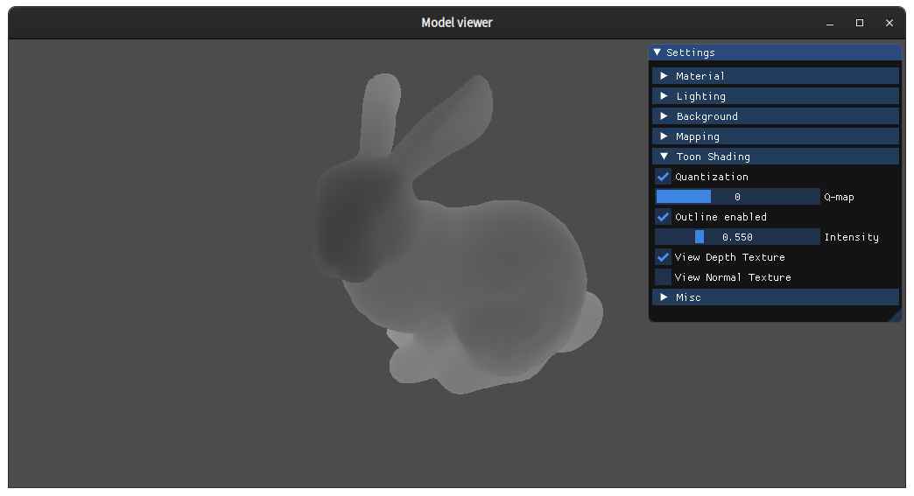

# Toon Shader with variable quantization and sobel edge detection
## Kai Schuyler Gonzalez

### Video script
Hi, I'm Kai Schuyler and this is my final project for the Computer Graphics course at Uppsala University. For the final project, I decided to extend the gltf viewer we used for the 3 assignments and implement cel shading to create a cartoon effect. This project consisted of 2 main parts:
* The first part involved creating a 1D texture of float values in order to quantize the illumination into steps, as you can see here.

* The second part involved rendering to a framebuffer object before rendering the final scene to create 2D depth and normal textures, as you can see here.

* I then applied a sobel filter on both textures to detect the edges

You can toggle all effects of the toon shader on and off, and all parts from the previous assignments still work. 

### References
[Cel Shading, Wikipedia](https://en.wikipedia.org/wiki/Cel_shading)
[Sobel Operator, Wikipedia](https://en.wikipedia.org/wiki/Sobel_operator)
[Framebuffers, open.gl](https://open.gl/framebuffers)